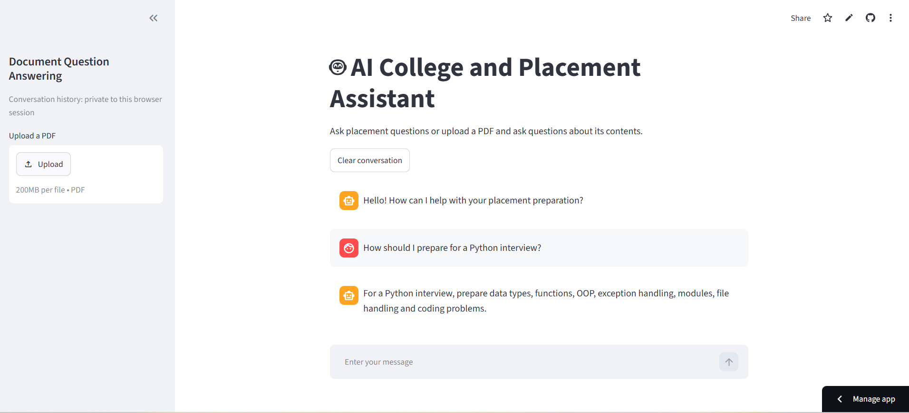

# AI College and Placement Assistant

An AI-powered chatbot that helps engineering students with placement preparation, technical interviews, resumes, aptitude, programming concepts, and document-based question answering.

The application combines rule-based intent detection, Google Gemini generative AI, SQLite conversation storage, Streamlit, and Retrieval-Augmented Generation (RAG).

## Live Demo

Try the deployed application:

[Launch AI College and Placement Assistant](https://kartik-ai-placement-assistant.streamlit.app/)



## Features

- Interactive Streamlit chatbot interface
- Rule-based intent detection for common questions
- Gemini-generated answers for general technical questions
- PDF upload and document question answering
- TF-IDF and cosine-similarity document retrieval
- Optional SQLite conversation history for local use
- Private browser-session history on public deployment
- Automatic Gemini retry handling
- Secure API-key configuration
- Automated testing using pytest
- Clear-conversation functionality

## Application Modes

### Normal Chatbot Mode

When no document is uploaded:

```text
User question
      ↓
Intent detection
      ↓
Known intent? ── Yes → Predefined response
      │
      No
      ↓
Gemini AI → Generated response
```

### Document Question-Answering Mode

When a PDF is uploaded:

```text
PDF upload
    ↓
Text extraction
    ↓
Text chunking
    ↓
TF-IDF retrieval
    ↓
Relevant chunks
    ↓
Gemini AI
    ↓
Document-based answer
```

## Technology Stack

| Component | Technology |
|---|---|
| Programming language | Python |
| Web interface | Streamlit |
| Generative AI | Google Gemini API |
| Database | SQLite |
| PDF processing | pypdf |
| Information retrieval | TF-IDF |
| Similarity measurement | Cosine similarity |
| Machine-learning library | scikit-learn |
| Testing | pytest |
| Deployment | Streamlit Community Cloud |
| Version control | Git and GitHub |

## Project Structure

```text
AI-College-Placement-Assistant/
├── assets/
│   └── chatbot-demo.png
├── chatbot/
│   ├── __init__.py
│   ├── ai_service.py
│   ├── chatbot.py
│   └── intents.py
├── database/
│   ├── __init__.py
│   └── database.py
├── documents/
├── rag/
│   ├── __init__.py
│   ├── document_processor.py
│   └── retriever.py
├── tests/
│   ├── test_chatbot.py
│   ├── test_database.py
│   └── test_rag.py
├── .env.example
├── .gitignore
├── app.py
├── README.md
└── requirements.txt
```

## Installation

### 1. Clone the Repository

```powershell
git clone https://github.com/kartikthorat8544/AI-College-Placement-Assistant.git
cd AI-College-Placement-Assistant
```

### 2. Create a Virtual Environment

```powershell
python -m venv .venv
```

### 3. Activate the Environment

PowerShell:

```powershell
.\.venv\Scripts\Activate.ps1
```

Command Prompt:

```cmd
.venv\Scripts\activate.bat
```

### 4. Install Dependencies

```powershell
pip install -r requirements.txt
```

## Gemini API Configuration

Create a Gemini API key using Google AI Studio.

Create a private `.env` file in the main project folder:

```env
GEMINI_API_KEY=your_actual_gemini_api_key
PERSIST_CHAT_HISTORY=true
```

Never commit the `.env` file or share the API key.

The `.env.example` file provides the required variable names without exposing a real key.

## Streamlit Cloud Configuration

Add the following settings through Streamlit Community Cloud secrets:

```toml
GEMINI_API_KEY = "your_actual_gemini_api_key"
PERSIST_CHAT_HISTORY = false
```

Setting `PERSIST_CHAT_HISTORY` to `false` ensures that public visitors cannot see one another’s conversation history.

## Run the Application

```powershell
streamlit run app.py
```

Open the local URL displayed in the terminal, normally:

```text
http://localhost:8501
```

## Using the Chatbot

### General Questions

Without uploading a PDF, ask questions such as:

```text
How should I prepare for a Python interview?
Explain Python decorators.
What skills should I learn for software placements?
```

### PDF Questions

1. Upload a text-based PDF using the sidebar.
2. Wait for the document-ready message.
3. Ask questions about its contents.
4. Remove the PDF to return to normal chatbot mode.

Example:

```text
What technical skills are mentioned in the document?
```

## RAG Implementation

The document-question-answering system performs the following operations:

1. Extracts text from every PDF page.
2. Divides the text into overlapping chunks.
3. Converts the chunks and question into TF-IDF vectors.
4. Calculates cosine-similarity scores.
5. Selects the most relevant chunks.
6. Sends only those chunks to Gemini.
7. Instructs Gemini to answer from the supplied context.

## Conversation History

The project supports two history modes:

### Local Mode

When this setting is enabled:

```env
PERSIST_CHAT_HISTORY=true
```

SQLite stores:

- User messages
- Assistant responses
- Message roles
- Creation timestamps

### Public Cloud Mode

When this setting is used:

```toml
PERSIST_CHAT_HISTORY = false
```

Messages remain only in the visitor’s active browser session. Different visitors cannot see one another’s conversations.

The local SQLite database is excluded from GitHub because it may contain private conversation history.

## Testing

Run all tests:

```powershell
python -m pytest -v
```

The test suite validates:

- Text normalization
- Pattern scoring
- Intent detection
- Intent priority
- Text chunking
- Chunk overlap
- TF-IDF retrieval
- SQLite message storage
- Message ordering
- Conversation deletion

The project currently contains 20 automated tests.

## Security and Privacy

- API keys are stored in `.env` locally and Streamlit Secrets online.
- `.env` is ignored by Git.
- Local SQLite databases are ignored.
- Uploaded PDFs are not committed.
- PDFs are processed temporarily in memory.
- Relevant document chunks are sent to Gemini in document mode.
- Public conversation history is private to each browser session.
- Users should avoid uploading highly sensitive documents.

## Limitations

- Scanned image-only PDFs require OCR and may not produce text.
- TF-IDF relies mainly on matching words rather than complete semantic meaning.
- Gemini responses depend on API availability and quota.
- Local SQLite history is intended for single-user development.
- The application requires an internet connection for Gemini responses.
- Cloud conversations are not retained after the visitor’s session ends.

## Future Improvements

- Semantic embedding-based retrieval
- OCR for scanned PDFs
- User authentication
- Persistent user-specific conversation history
- Resume-analysis scoring
- Mock-interview mode
- Company-specific preparation modules
- Response streaming
- Voice input and output

## Learning Outcomes

This project demonstrates practical knowledge of:

- Python project organization
- Streamlit application development
- Natural-language intent detection
- Generative-AI API integration
- Prompt engineering
- Environment variables
- SQLite and SQL
- PDF text extraction
- Retrieval-Augmented Generation
- TF-IDF and cosine similarity
- Error handling and API retries
- Automated testing
- Secure cloud deployment
- Git and GitHub

## Author

**Kartik Thorat**

Final-year Electronics and Telecommunication Engineering student interested in Python, artificial intelligence, and software development.